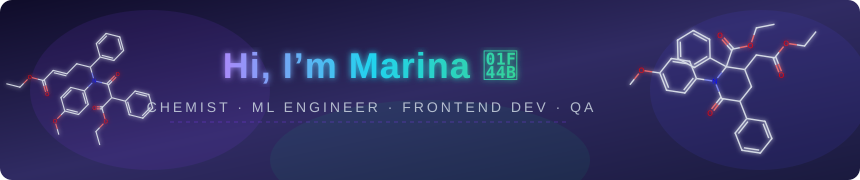

  

    
  

  ---

  ## 👤 About Me

  - 🧪 Chemist at heart — built a database of organic compounds with visualization
  - 🤖 Training ML models on medical & time-series data with TensorFlow
  - ⚡ Learning React & building frontends that don't break
  - 🎯 Making sure things actually work — Playwright test automation
  - 📚 Currently exploring: deep learning, bioinformatics pipelines, UI/UX patterns

  ---

  ## 🛠️ Skills & Stack

  ### 🧪 Chemistry & Bio
  
  

  ### 🤖 ML & Data
  
  
  
  
  

  ### ⚡ Frontend
  
  
  
  

  ### 🎯 QA & Testing
  
  

  ---

  ## 🚀 Projects

  | Project | Description | Stack |
  |---------|-------------|-------|
  | [🧪 organic-chemicals-db](https://github.com/marishachem/organic-chemicals-db) | Database of organic compounds with visualization & analysis | Python |
  | [🤖 ML_learning](https://github.com/marishachem/ML_learning) | ML notebooks — diabetes prediction, time-series, anomaly detection | TensorFlow, Jupyter |
  | [⚡ learning_react](https://github.com/marishachem/learning_react) | React course experiments & mini apps | React, JavaScript |
  | [🎯 SeleniumTest](https://github.com/marishachem/SeleniumTest) | Selenium UI test automation scripts | Selenium, Python |

  ---

  

  
  

